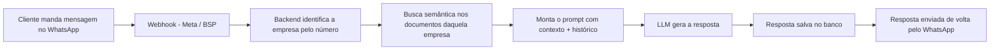
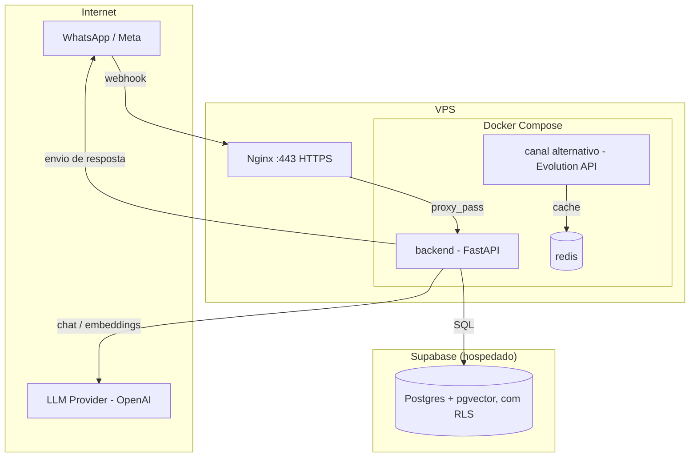
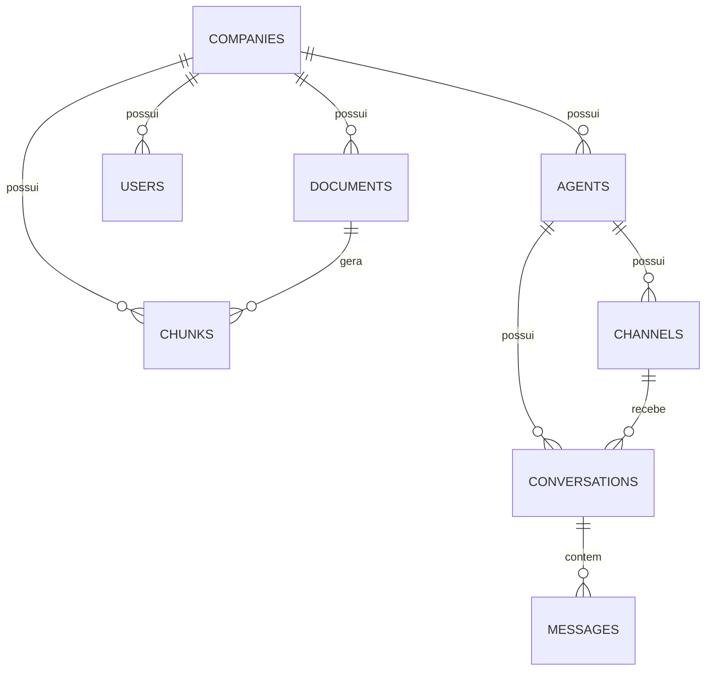

# Plataforma de Chatbot Multi-Tenant com IA e RAG

Backend de um chatbot de atendimento via WhatsApp, adaptável a qualquer
segmento de negócio, com respostas geradas por IA a partir da base de
documentos própria de cada cliente (RAG). Arquitetura **multi-tenant**: uma
única instalação atende várias empresas ao mesmo tempo, cada uma com seu
próprio número de WhatsApp, seu próprio agente de IA e sua própria base de
conhecimento, com isolamento de dados entre elas.

> Projeto em produção, atendendo um cliente real. Este repositório é a base
> de código do backend; um painel administrativo web (consumo direto do
> banco via Supabase) está em desenvolvimento por outro colaborador.

## O problema

Empresas de atendimento ao cliente recebem um volume alto de perguntas
repetitivas ("quais são os planos disponíveis?", "quanto tempo demora?",
"qual o valor?"). O chatbot responde essas perguntas automaticamente,
usando como fonte de verdade os documentos reais de cada empresa — não o
conhecimento genérico do modelo de linguagem — e escala para um humano
quando necessário.

## Como funciona (visão geral)

## Arquitetura

O banco de dados roda no Supabase (Postgres gerenciado, com `pgvector` e Row
Level Security habilitados); o backend continua na própria VPS, atrás de
Nginx com HTTPS. Só o backend fica exposto publicamente — os demais serviços
escutam apenas localmente.

## Modelo de dados (multi-tenant)

Cada empresa (`companies`) tem um ou mais agentes de IA (`agents`), cada
agente tem um ou mais canais (`channels`), cada canal recebe conversas
(`conversations`) compostas de mensagens (`messages`). Cada empresa mantém
sua própria base de documentos (`documents`), fatiados em pedaços menores
(`chunks`) com seus vetores de embedding.

## Stack técnica

| Camada | Tecnologia | Por quê |
|---|---|---|
| Backend | Python 3.10 + FastAPI | Assíncrono nativamente — cada mensagem dispara várias chamadas de rede (banco, LLM, WhatsApp) em paralelo; gera documentação OpenAPI automaticamente |
| Banco de dados | PostgreSQL + `pgvector`, hospedado no Supabase | Guarda dados relacionais e vetores de embedding no mesmo banco, sem precisar de um banco vetorial dedicado; Supabase adiciona Realtime e Row Level Security prontos para o painel administrativo |
| ORM / Migrations | SQLAlchemy (async) + Alembic | Schema versionado como código |
| IA | OpenAI (`gpt-*` para chat, `text-embedding-3-small` para embeddings) | Suporte a modelo local (Ollama) implementado via padrão *factory*, para eventual migração a infraestrutura própria |
| Mensageria | WhatsApp Cloud API (Meta), via BSP | Canal oficial para clientes reais; canal alternativo (Evolution API) implementado como opção, isolado atrás da mesma abstração de canal |
| Orquestração | Docker + Docker Compose | Ambiente reprodutível, sem dependência da máquina de desenvolvimento |
| Proxy / HTTPS | Nginx + Let's Encrypt | Backend nunca fica exposto diretamente à internet |

## Decisões de arquitetura que valem destaque

**Isolamento multi-tenant em duas camadas.** Toda busca de documentos é
filtrada por `company_id` na camada de aplicação, e o banco (Supabase) tem
Row Level Security habilitado nas tabelas de negócio, com políticas
que restringem cada acesso à empresa correspondente — pensado para que
um cliente futuro (o painel administrativo, conectando direto no banco)
nunca consiga ver dados de outra empresa, mesmo com uma query mal escrita.

**Providers plugáveis via *factory*.** Tanto o provedor de IA quanto o canal
de mensagem são escolhidos em tempo de execução a partir de uma string
salva no banco (`"openai"`/`"ollama"`, `"whatsapp_cloud"`/`"evolution"`).
Trocar de modelo de IA ou adicionar um canal novo não exige tocar no
orquestrador principal — só implementar a interface e registrar na factory.

**RAG com `pgvector` em vez de um banco vetorial dedicado.** Os embeddings
de cada chunk de documento ficam na mesma instância Postgres que o resto
dos dados relacionais, simplificando a infraestrutura (um banco a menos
para operar) sem abrir mão de busca por similaridade vetorial.

**Migração de banco local para gerenciado sem downtime perceptível.** O
banco começou num container Postgres local e foi migrado para o Supabase
já em produção — dump/restore validados por contagem de linhas e por um
teste funcional de busca vetorial antes do cutover, com o backend apontando
para o novo banco só depois de tudo validado.

## Documentação completa

A pasta [`docs/`](./docs) tem um manual técnico capítulo por capítulo:
visão geral, arquitetura, banco de dados, pipeline de RAG (chunking,
embeddings, ingestão), Docker, canais de mensagem, backend, deploy,
troubleshooting real (com os problemas efetivamente encontrados e como
foram resolvidos) e um glossário. Comece por
[`docs/README.md`](./docs/README.md).

## Estado atual

Em produção, atendendo um cliente real via WhatsApp. Não há ainda painel
administrativo web nem testes automatizados — o painel está em
desenvolvimento (ver [`docs/21-guia-painel-supabase.md`](./docs/21-guia-painel-supabase.md)
para o guia de integração), e testes automatizados são um próximo passo
conhecido.

---

*Este projeto foi desenvolvido com apoio de IA (Claude) como par de
arquitetura e mentoria técnica ao longo de todas as fases — do desenho do
schema à migração de banco de dados em produção.*
