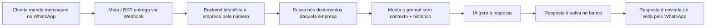

# 1. Visão Geral

## 1.1 O que este projeto é

É um chatbot de atendimento via WhatsApp, que responde perguntas de clientes
usando um modelo de linguagem (IA) combinado com uma base de documentos
própria de cada empresa cliente. É genérico o suficiente para atender
qualquer segmento de negócio — o que muda de um cliente para outro é só o
conteúdo da base de conhecimento e a configuração do agente, nunca o código.
É uma plataforma **multi-tenant** (multi-cliente): uma única instalação do
sistema atende várias empresas diferentes ao mesmo tempo, cada uma com seu
próprio número de WhatsApp, seu próprio agente de IA (com personalidade e
regras próprias) e sua própria base de conhecimento — sem que uma empresa
nunca veja dados de outra.

## 1.2 O problema que resolve

Empresas que recebem um volume alto de perguntas repetitivas de clientes
("quais são os planos disponíveis?", "quanto tempo demora?", "qual o
valor?") normalmente dependem de um atendente humano para responder cada
uma. O chatbot responde essas perguntas automaticamente, usando como fonte
de verdade os documentos reais daquela empresa (não o conhecimento genérico
da IA), e só escala para um humano quando necessário (ver
`conversations.status` no [capítulo 4](./04-banco-de-dados.md)).

## 1.3 Fluxo geral (resumido)

Cada uma dessas caixas é detalhada tecnicamente no
[capítulo 17](./17-fluxo-completo-mensagem.md). Este capítulo fica só na
visão de negócio.

## 1.4 Tecnologias utilizadas e por que cada uma foi escolhida

| Tecnologia | Para que serve neste projeto | Por que essa escolha |
|---|---|---|
| **Python 3.10** | Linguagem do backend | Ecossistema maduro para IA/LLMs, e é a linguagem que o time já domina |
| **FastAPI** | Framework web que expõe a API e os webhooks | Assíncrono nativamente (importante porque cada mensagem envolve várias chamadas de rede: banco, OpenAI, WhatsApp), gera documentação OpenAPI automaticamente, validação de dados via Pydantic |
| **PostgreSQL 16** | Banco de dados relacional principal | Robusto, gratuito, e com a extensão `pgvector` permite guardar tanto os dados relacionais (empresas, conversas) quanto os vetores de IA (embeddings) no mesmo banco, sem precisar de um banco vetorial separado |
| **pgvector** | Extensão do Postgres para busca vetorial (usada no RAG) | Evita ter que rodar e manter um banco vetorial dedicado (ex: Pinecone, Weaviate) só para a busca semântica — ver [capítulo 7](./07-embeddings.md) |
| **SQLAlchemy (async) + Alembic** | ORM (mapeamento objeto-relacional) e controle de migrações do banco | Permite escrever o schema do banco como classes Python, e versionar toda mudança de schema como código (ver [capítulo 4](./04-banco-de-dados.md)) |
| **Docker + Docker Compose** | Empacotamento e orquestração de todos os serviços | Garante que o ambiente rode igual na VPS e em qualquer outra máquina, sem "na minha máquina funciona" — ver [capítulo 9](./09-docker.md) |
| **OpenAI API** (`gpt-5.4-mini` + `text-embedding-3-small`) | Geração de respostas e geração de embeddings | Escolhido no lugar de um modelo local (Ollama) para a fase de produção porque não exige hardware de GPU dedicado na VPS e tem qualidade de resposta mais consistente. O Ollama continua implementado no código (ver `app/llm/providers/ollama_provider.py`) para uma eventual migração a um servidor de IA próprio no futuro |
| **Nginx** | Proxy reverso na frente do backend | Termina HTTPS (certificado via Let's Encrypt) e expõe só a porta 443 publicamente — o backend em si nunca fica exposto diretamente à internet |
| **WhatsApp Cloud API (Meta)**, via BSP Datafy | Canal oficial de mensagens para clientes reais | API oficial da Meta, ao contrário de soluções não-oficiais (ver Evolution API abaixo) — ver [capítulo 10](./10-canais-de-mensagem.md) |
| **Evolution API** | Canal alternativo de WhatsApp (implementado, não usado em produção hoje) | Não depende de aprovação da Meta, mas roda por engenharia reversa do WhatsApp Web — risco de banimento do número. Mantido no código como opção, mas o cliente real usa WhatsApp Cloud API |
| **n8n** | Automação visual (usado só na fase inicial do projeto) | Hoje roda mas está fora do caminho de produção — ver [capítulo 15](./15-n8n.md) |
| **Redis** | Cache em memória | Usado internamente pela Evolution API para cache de sessão; o backend principal não depende dele hoje |

## 1.5 O que este projeto **não** é (ainda)

Para deixar expectativas claras: não existe painel administrativo web, não
existe autenticação de usuários funcional (a tabela `users` existe no banco
mas não tem nenhuma rota de API construída em cima dela), e não existem
testes automatizados. Essas ausências são intencionais para esta fase do
projeto (MVP) e estão detalhadas como pendências conhecidas no
[capítulo 19 (FAQ)](./19-faq.md).
