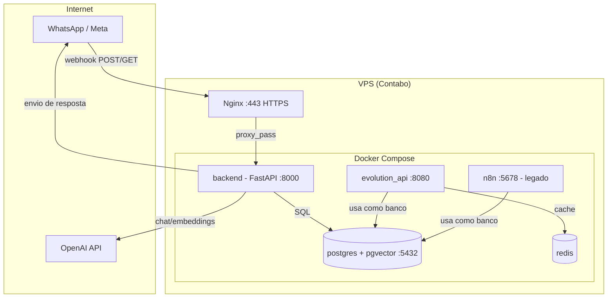
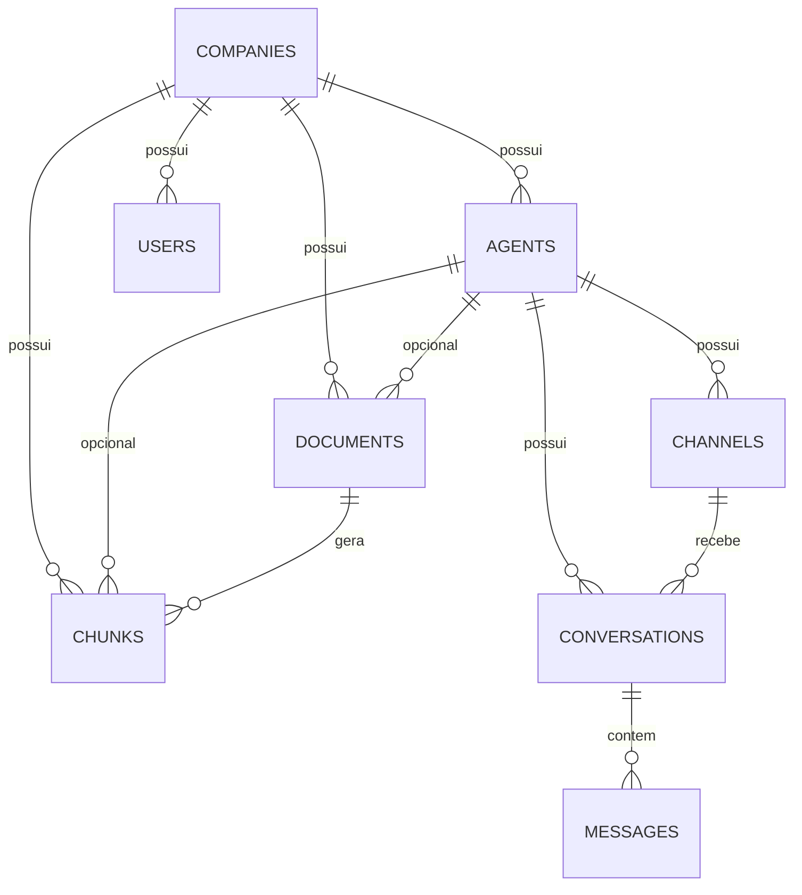

# 2. Arquitetura

## 2.1 Antes de tudo: o que é um container e por que Docker

Se você nunca trabalhou com Docker: um **container** é um processo isolado
que roda com suas próprias dependências (bibliotecas, versão de linguagem,
arquivos) sem interferir no resto do sistema operacional nem em outros
containers. É diferente de uma máquina virtual (VM) — não emula um hardware
inteiro, só isola o processo. Isso permite rodar, por exemplo, Postgres,
Redis e o backend Python na mesma máquina física, cada um "pensando" que tem
o sistema só para si, sem que a versão de uma biblioteca de um afete a de
outro. O **Docker Compose** é a ferramenta que descreve, num único arquivo
(`docker-compose.yml`), quais containers existem, como eles se conectam entre
si e quais portas ficam expostas. O [capítulo 9](./09-docker.md) aprofunda
isso.

## 2.2 Componentes do sistema

Só o `backend` (porta 8000, atrás do Nginx) está acessível publicamente. Todo
o resto (`postgres`, `redis`, `evolution_api`, `n8n`) escuta apenas em
`127.0.0.1` — ou seja, só é acessível de dentro da própria VPS, nunca
diretamente da internet. Isso é uma camada de segurança básica: mesmo que
alguém descubra a porta do Postgres, não consegue nem tentar se conectar de
fora.

## 2.3 O modelo de dados multi-tenant

Este é o conceito mais importante do projeto — quase tudo mais depende dele.
"Multi-tenant" significa que um único sistema (um único backend, um único
banco de dados) atende várias empresas ao mesmo tempo, isoladas entre si.

Em palavras simples:

Uma **empresa** (`companies`) é o cliente que paga pelo serviço — ex: uma
empresa fictícia, "Contoso Serviços". Uma empresa pode ter um ou mais **agentes** (`agents`): cada agente é
uma "personalidade" de IA diferente, com seu próprio prompt, modelo e
temperatura (uma empresa poderia, por exemplo, ter um agente para triagem
inicial e outro para dúvidas técnicas — hoje, na prática, cada empresa tem
um único agente). Cada agente tem um ou mais **canais** (`channels`) — hoje
sempre um número de WhatsApp, mas o desenho já suporta Telegram, Instagram
etc. Cada mensagem que chega gera ou reaproveita uma **conversa**
(`conversations`), identificada pelo número de quem está escrevendo. Dentro
de uma conversa, cada pergunta e cada resposta viram uma **mensagem**
(`messages`) separada. Uma empresa sobe **documentos** (`documents`) — os
PDFs/TXTs da base de conhecimento dela — que são fatiados em **chunks**
(pedaços menores, ver [capítulo 6](./06-chunking.md)) com seu vetor de
embedding.

## 2.4 O que garante o isolamento entre empresas

Não existe nenhum mecanismo de banco de dados (como Row-Level Security) que
impeça uma query mal escrita de misturar dados de duas empresas — o
isolamento hoje é garantido **pela aplicação**, sempre filtrando por
`company_id`. Os dois pontos mais críticos disso são:

1. **Busca RAG** (`KnowledgeService.search`, [capítulo 7](./07-embeddings.md)):
   toda busca de chunks é filtrada por `company_id`. Sem esse filtro, a IA de
   uma empresa poderia "ver" documentos de outra.
2. **Identificação de canal pelo webhook** (`ChannelRepository.get_by_identifier`,
   [capítulo 10](./10-canais-de-mensagem.md)): o `phone_number_id` que chega
   no payload do WhatsApp é usado para achar o canal certo no banco, e o
   canal certo aponta para o agente certo, que aponta para a empresa certa.
   Se dois números diferentes (de empresas diferentes) tivessem, por engano,
   o mesmo `identifier` cadastrado, haveria vazamento de dados entre elas —
   por isso `identifier` deve ser sempre único e correto na hora de cadastrar
   um cliente novo (ver [capítulo 4, seção "Criar um cliente novo"](./04-banco-de-dados.md)).

Esse isolamento foi testado deliberadamente durante o desenvolvimento: duas
empresas de teste, cada uma com um "fato-canário" fictício (um dado que só
existe no documento daquela empresa, inventado especificamente para o
teste), foram consultadas cruzadas — cada uma respondeu corretamente que não
tinha informação sobre o fato da outra.

## 2.5 Abstrações por trás do sistema: por que existem "factories"

Dois pontos do sistema usam um padrão de projeto chamado **Factory**: dado o
nome de algo como texto (uma string), a factory devolve o objeto certo já
configurado, sem quem chamou precisar saber os detalhes de implementação.

- `app/llm/factory.py` → dado `"openai"` ou `"ollama"`, devolve o provider de
  IA certo.
- `app/channels/factory.py` → dado `"whatsapp_cloud"` ou `"evolution"`,
  devolve o provider de canal certo.

A vantagem prática: **trocar de modelo de IA ou adicionar um novo canal de
mensagem nunca exige tocar no resto do sistema** — só criar a nova classe e
adicionar uma linha no dicionário da factory. O `ConversationService` (o
"maestro" do sistema, ver [capítulo 17](./17-fluxo-completo-mensagem.md))
nunca sabe se está falando com OpenAI ou Ollama, nem se a mensagem veio do
WhatsApp ou do Telegram — ele só conhece a interface abstrata
(`LLMProvider` e `ChannelProvider`, definidas em `app/llm/base.py` e
`app/channels/base.py`).

## 2.6 RAG — visão de arquitetura (detalhes no capítulo 7)

RAG (*Retrieval-Augmented Generation*) é a técnica de buscar informação
relevante em uma base de documentos **antes** de pedir para a IA responder,
e injetar essa informação no prompt como contexto. Isso é o que permite ao
mesmo modelo de IA (`gpt-5.4-mini`) responder de forma diferente e correta
para cada empresa, mesmo sem ter sido treinado especificamente nos dados
delas. A arquitetura de RAG deste projeto tem três peças: o texto do
documento é fatiado em **chunks** (capítulo 6), cada chunk vira um vetor
numérico via **embeddings** (capítulo 7), e na hora da pergunta o sistema
busca os chunks matematicamente mais "parecidos" com a pergunta usando
`pgvector` (capítulo 7).
