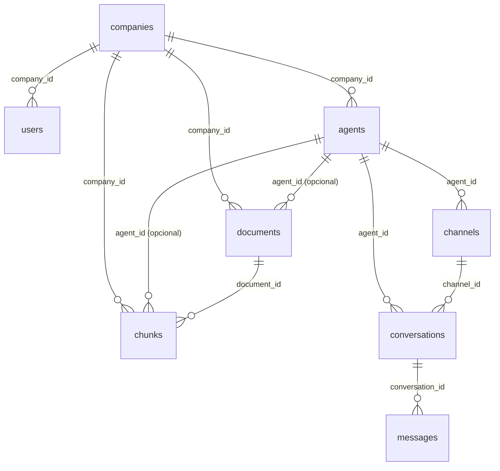

# 4. Banco de Dados

## 4.0 O banco hoje vive no Supabase, não mais num container local

O schema descrito neste capítulo (as 8 tabelas) foi originalmente criado
rodando num container Postgres local, na própria VPS. Ele foi migrado para
o **Supabase** (Postgres hospedado, com extensão `pgvector` habilitada) —
o backend continua na VPS, só o banco mudou de lugar. O container Postgres
local ainda existe e roda, mas hoje serve só o n8n e a Evolution API
(schemas próprios, não migrados — ver [capítulo 15](./15-n8n.md)); os dados
de negócio (`public`) que ficaram lá são uma cópia congelada do momento da
migração, não devem mais ser considerados fonte de verdade.

A conexão do backend com o Supabase usa o **pooler em modo Session**
(`aws-0-<região>.pooler.supabase.com:5432`), não a conexão direta — isso
porque o hostname da conexão direta só tem endereço IPv6, e containers
Docker não têm IPv6 habilitado por padrão (ver
[capítulo 18](./18-troubleshooting.md) para o diagnóstico completo desse
problema). O usuário de conexão nesse modo tem um formato diferente:
`postgres.<id-do-projeto>`, não só `postgres`.

## 4.1 Conceitos: o que é uma migration

Antes de falar do schema, um conceito importante: uma **migration** é um
arquivo de código que descreve uma mudança no banco de dados (criar uma
tabela, adicionar uma coluna, etc.) de forma versionada — como um commit do
Git, mas para a estrutura do banco. A ferramenta usada aqui é o **Alembic**.
Cada migration tem uma função `upgrade()` (aplica a mudança) e uma
`downgrade()` (desfaz). Rodar `alembic upgrade head` aplica todas as
migrations que ainda não foram aplicadas, em ordem. Hoje existe uma única
migration no projeto: `001_initial_clean_schema.py`, que cria as 8 tabelas
do zero. Detalhes de como criar uma nova migration estão no
[capítulo 14 (Deploy)](./14-deploy.md).

## 4.2 Diagrama de relacionamento



## 4.3 As tabelas, uma a uma

### `companies`
A empresa cliente da plataforma.

| Coluna | Tipo | Observação |
|---|---|---|
| `id` | uuid | PK, gerado automaticamente (`gen_random_uuid()`) |
| `name` | varchar | Nome de exibição, ex: "Contoso Serviços" |
| `slug` | varchar | Identificador único em formato URL (`contoso-servicos`) — usado como nome de pasta na Base de Conhecimento |
| `status` | varchar | `active` por padrão |
| `created_at` / `updated_at` | timestamptz | |

Quem escreve: só via SQL direto (não existe rota de API ainda). Quem lê: o
`AgentService` (indiretamente, via `agent.company_id`) e o
`KnowledgeService` (filtro de busca RAG).

### `users`
Usuário do futuro painel administrativo. **Hoje esta tabela existe no schema
mas não é usada por nenhum fluxo ativo** — não há rota de login, nem
verificação de senha implementada. Preparada para quando o painel
administrativo (fora do escopo deste MVP) for construído.

### `agents`
O agente de IA — nome, prompt, modelo, temperatura.

| Coluna | Tipo | Observação |
|---|---|---|
| `id` | uuid | PK |
| `company_id` | uuid | FK → `companies.id` |
| `name` | varchar | Nome interno do agente |
| `description` | text | Opcional, anotação livre |
| `llm_provider` | varchar | `"openai"` ou `"ollama"` — usado pela factory (capítulo 2) |
| `llm_model` | varchar | Ex: `"gpt-5.4-mini"` |
| `temperature` | float | Controla aleatoriedade da resposta (0 = sempre a resposta mais provável, valores maiores = mais variação) — padrão `0.4` |
| `system_prompt` | text | A personalidade e as regras do agente — isso é o que muda o comportamento sem tocar em código |
| `status` | varchar | `active` por padrão |

### `channels`
O canal de comunicação (hoje sempre WhatsApp) vinculado a um agente.

| Coluna | Tipo | Observação |
|---|---|---|
| `id` | uuid | PK |
| `agent_id` | uuid | FK → `agents.id` |
| `provider` | varchar | `"whatsapp_cloud"` ou `"evolution"` |
| `identifier` | varchar | Chave usada pelo webhook para achar este canal — `phone_number_id` (WhatsApp Cloud) ou nome da instância (Evolution) |
| `config` | **jsonb** | Credenciais específicas do canal — ver abaixo |
| `status` | varchar | `active` por padrão |

O campo `config` é um JSON livre (tipo `jsonb` do Postgres, que permite
consultar campos internos do JSON via SQL — ver a query de
`verify_token` no [capítulo 10](./10-canais-de-mensagem.md)). Para
`whatsapp_cloud`, o formato usado é:

```json
{
    "phone_number_id": "570906922765104",
    "access_token": "sk_live_xxx ou token da Meta",
    "verify_token": "qualquer_string_escolhida_por_voce",
    "api_base_url": "https://cloud.datafyapi.com.br/v1"
}
```

`api_base_url` é opcional — se omitido, o sistema usa a Graph API oficial da
Meta diretamente. É assim que um canal pode usar a Meta direto e outro pode
usar um BSP (como a Datafy) sem nenhuma mudança de código, só de dado no
banco. Detalhes completos no [capítulo 10](./10-canais-de-mensagem.md).

### `conversations`
Uma sessão de conversa com um número específico.

| Coluna | Tipo | Observação |
|---|---|---|
| `id` | uuid | PK |
| `agent_id` | uuid | FK → `agents.id` |
| `channel_id` | uuid, nullable | FK → `channels.id` |
| `session_id` | varchar | Formato `"provider:numero"`, ex: `"whatsapp_cloud:5511932971861"` — é a chave de busca principal |
| `from_id` | varchar, nullable | O número puro, sem o prefixo do provider |
| `status` | varchar | `"ai_active"` (padrão) \| `"human_active"` \| `"waiting_human"` |

O campo `status` é o mecanismo de pausa da IA. Enquanto for `"ai_active"`, o
bot responde normalmente. Qualquer outro valor faz o sistema salvar a
mensagem do usuário mas **não** chamar a IA nem enviar resposta — o
`ConversationService` verifica isso antes de qualquer chamada de IA (ver
[capítulo 17](./17-fluxo-completo-mensagem.md)). Não existe hoje nenhuma
interface que altere esse campo automaticamente — a alteração é sempre um
`UPDATE` manual:

```sql
-- Pausar a IA numa conversa específica (um humano vai assumir)
UPDATE conversations
SET status = 'human_active'
WHERE session_id = 'whatsapp_cloud:5511999999999';

-- Reativar a IA
UPDATE conversations
SET status = 'ai_active'
WHERE session_id = 'whatsapp_cloud:5511999999999';
```

### `messages`
Cada linha é uma mensagem — do usuário (`role='user'`) ou da IA
(`role='assistant'`). O `HistoryService` (ver
[capítulo 17](./17-fluxo-completo-mensagem.md)) carrega as 10 mais recentes
de cada conversa para dar memória à IA.

### `documents`
Um arquivo (PDF/TXT) enviado para a Base de Conhecimento de uma empresa.
`agent_id` é opcional: `NULL` significa "compartilhado por todos os agentes
da empresa"; um UUID específico restringe o documento a um único agente.

### `chunks`
Um pedaço (fatia) de um documento, com seu vetor de embedding. Ver
[capítulos 6 e 7](./06-chunking.md). Repare que `company_id` está duplicado
aqui — já existe em `documents.company_id`, mas foi replicado
propositalmente em `chunks` para que a busca RAG (que roda a cada mensagem
recebida, é a operação mais frequente do sistema) não precise de um `JOIN`
com `documents` só para filtrar por empresa. Essa é uma decisão consciente
de performance chamada *denormalização*.

## 4.4 Chaves estrangeiras (FKs) — resumo

| Tabela | Coluna | Referencia |
|---|---|---|
| `users` | `company_id` | `companies.id` |
| `agents` | `company_id` | `companies.id` |
| `channels` | `agent_id` | `agents.id` |
| `conversations` | `agent_id` | `agents.id` |
| `conversations` | `channel_id` | `channels.id` |
| `messages` | `conversation_id` | `conversations.id` |
| `documents` | `company_id` | `companies.id` |
| `documents` | `agent_id` | `agents.id` |
| `chunks` | `document_id` | `documents.id` |
| `chunks` | `company_id` | `companies.id` |
| `chunks` | `agent_id` | `agents.id` |

## 4.5 Índices de performance

| Tabela | Índice | Para quê |
|---|---|---|
| `conversations` | `idx_conversations_session (session_id, agent_id)` | Achar a conversa ativa de um número rapidamente — consultado a cada mensagem recebida |
| `messages` | `idx_messages_conversation (conversation_id, created_at)` | Carregar o histórico ordenado cronologicamente |
| `chunks` | `idx_chunks_company (company_id)` | Filtrar chunks por empresa antes/durante a busca vetorial |
| `companies` | `companies_slug_key` (unique) | Garantir que não existam dois `slug` iguais |
| `users` | `users_email_key` (unique) | Garantir e-mail único |

## 4.6 Como criar um cliente novo (passo a passo em SQL)

Este é o padrão que já usamos duas vezes em produção (empresa de teste e o
primeiro cliente real). É um único `INSERT` encadeado, usando
uma **CTE** (`WITH ... AS (...)`) — uma forma de dizer ao Postgres "insira
nesta tabela, pegue o ID gerado, e use esse ID no próximo INSERT",
tudo numa transação atômica (ou tudo funciona, ou nada é salvo).

```sql
WITH nova_empresa AS (
    INSERT INTO public.companies (name, slug, status)
    VALUES ('Nome da Empresa', 'nome-da-empresa', 'active')
    RETURNING id
),
novo_agente AS (
    INSERT INTO public.agents (company_id, name, description, llm_provider, llm_model, temperature, system_prompt, status)
    SELECT
        id,
        'Agente Nome da Empresa',
        'Descrição livre',
        'openai',
        'gpt-5.4-mini',
        0.4,
        'Prompt do sistema aqui',
        'active'
    FROM nova_empresa
    RETURNING id, company_id
),
novo_canal AS (
    INSERT INTO public.channels (agent_id, provider, identifier, name, status, config)
    SELECT
        id,
        'whatsapp_cloud',
        'PHONE_NUMBER_ID_REAL',
        'WhatsApp - Nome da Empresa',
        'active',
        jsonb_build_object(
            'phone_number_id', 'PHONE_NUMBER_ID_REAL',
            'access_token', 'TOKEN_REAL',
            'verify_token', 'qualquer_string_sua',
            'api_base_url', 'https://cloud.datafyapi.com.br/v1'
        )
    FROM novo_agente
    RETURNING id, agent_id
)
SELECT
    (SELECT id FROM nova_empresa)  AS company_id,
    (SELECT id FROM novo_agente)   AS agent_id,
    (SELECT id FROM novo_canal)    AS channel_id;
```

**Riscos se feito incorretamente:** se o `identifier` do canal (o
`phone_number_id`) já existir em outro canal ativo, o webhook pode ficar
ambíguo — sempre confira antes com
`SELECT * FROM channels WHERE identifier = '...'`. Se esquecer o
`api_base_url` para um número que usa BSP (Datafy), o envio de mensagens vai
tentar a Graph API da Meta diretamente e falhar silenciosamente (o log vai
mostrar erro HTTP na tentativa de envio).

Depois de criar, o próximo passo é alimentar a Base de Conhecimento — ver
[capítulo 8](./08-processo-de-ingestao.md).

## 4.7 Como editar um cliente existente

Qualquer coluna pode ser alterada com `UPDATE` direto. Os casos mais comuns:

```sql
-- Trocar o prompt do agente
UPDATE agents SET system_prompt = 'Novo prompt aqui' WHERE id = 'UUID_DO_AGENTE';

-- Trocar o token de acesso de um canal (ex: token da Meta expirado)
UPDATE channels
SET config = jsonb_set(config, '{access_token}', '"NOVO_TOKEN"')
WHERE id = 'UUID_DO_CANAL';

-- Desativar um canal sem apagar
UPDATE channels SET status = 'inactive' WHERE id = 'UUID_DO_CANAL';
```

`jsonb_set` altera apenas a chave especificada dentro do JSON, sem precisar
reescrever o objeto inteiro — importante para não apagar acidentalmente
outras chaves do `config`. Mudanças no banco têm efeito **imediato**, sem
precisar reiniciar ou reconstruir nenhum container.

## 4.8 Como excluir um cliente

```sql
DELETE FROM companies WHERE id = 'UUID_DA_EMPRESA';
```

Como todas as FKs relevantes (`agents.company_id`, `documents.company_id`,
`chunks.company_id`, etc.) foram criadas com `ON DELETE CASCADE`
(ver `001_initial_clean_schema.py`), apagar a empresa apaga automaticamente
todos os agentes, canais, conversas, mensagens, documentos e chunks
associados. **Isso é irreversível** — não existe soft-delete implementado.
Se quiser só desativar temporariamente sem perder dados, use
`UPDATE companies SET status = 'inactive' WHERE id = '...'` em vez de
`DELETE` (nota: hoje nenhum fluxo do sistema verifica esse `status` da
empresa antes de responder — só o `conversations.status` é checado — então
"inativar" a empresa não pausa o bot sozinho; para pausar de fato, use o
`UPDATE conversations` da seção 4.3, ou desative o canal).

## 4.9 Backup

O banco roda dentro de um volume Docker (`postgres_data`) na VPS. A
estratégia de backup atual é o **Auto Backup diário da própria Contabo**
(snapshot em nível de VM, fora do controle deste projeto) — decisão tomada
conscientemente para o estágio atual (poucos clientes, MVP), em vez de um
script de `pg_dump` agendado. Se o volume de dados crescer, vale revisitar
essa decisão e implementar um `pg_dump` agendado com retenção própria,
independente do backup de infraestrutura da VPS. Importante: agora que os
dados vivem no Supabase, o Auto Backup da Contabo (que é só da VM) **não
cobre mais** os dados de negócio — vale considerar o backup automático do
próprio Supabase (disponível a partir do plano Pro) ou um `pg_dump` manual
agendado apontando para lá.

## 4.10 RLS (Row Level Security) — preparando o painel administrativo

Migration `002` (`rls_setup`) adicionou uma segunda camada de isolamento
entre empresas, pensada para quando o painel administrativo passar a se
conectar **direto** no Supabase (via API/SDK, não através do backend). Até
aqui, o isolamento entre empresas era garantido só pelo código do backend
(filtro `company_id` em toda query) — RLS adiciona essa mesma garantia
**dentro do próprio Postgres**, para qualquer conexão que não seja o
backend.

**O que a migration mudou:**

Três colunas novas, denormalizadas (mesmo padrão já usado em `chunks`):
`conversations.company_id`, `messages.company_id`, `channels.company_id` —
evitam que as políticas de RLS precisem fazer `JOIN` a cada checagem.

RLS habilitado (`ENABLE ROW LEVEL SECURITY`) nas 8 tabelas de negócio, e
políticas criadas para `companies`, `agents`, `channels`, `conversations`
(SELECT + UPDATE) e `messages` (SELECT) — todas filtrando por
`company_id = (auth.jwt() -> 'app_metadata' ->> 'company_id')::uuid`, ou
seja, comparando com um metadado customizado guardado no próprio usuário do
Supabase Auth que faz login no painel. `users`, `documents` e `chunks`
ficaram com RLS ligado mas sem nenhuma política — completamente bloqueadas
para qualquer acesso via API, até que sejam necessárias.

Realtime (`ALTER PUBLICATION supabase_realtime ADD TABLE ...`) habilitado em
`conversations` e `messages`, para o painel poder escutar mudanças ao vivo.

**Por que isso não muda nada no backend:** o backend se conecta como o
papel `postgres` (via pooler), que tem o atributo `BYPASSRLS` por padrão em
qualquer projeto Supabase — ignora RLS completamente, em qualquer tabela,
sempre. As políticas afetam só quem se conecta como `anon` ou
`authenticated` (o caminho do painel).

**Como criar um operador novo para o painel** (procedimento manual, sem
tela de cadastro ainda):
```sql
UPDATE auth.users
SET raw_app_meta_data = raw_app_meta_data || jsonb_build_object('company_id', 'UUID_DA_EMPRESA')
WHERE email = 'email_do_operador@empresa.com';
```
(depois de criar o usuário em Authentication → Users, no dashboard do
Supabase). Ver [capítulo 21](./21-guia-painel-supabase.md) para o guia
completo de integração do painel.
