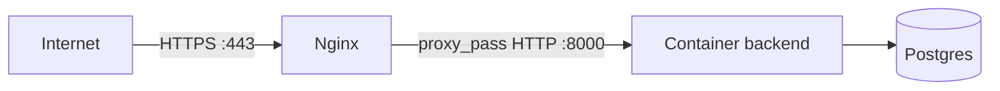

# 14. Deploy

## 14.1 Onde o projeto roda

VPS Contabo, com Nginx como proxy reverso terminando HTTPS via Let's
Encrypt/Certbot, na frente do container do backend. Domínio:
`api.speedbot.space`.



## 14.2 Nginx — configuração real

`/etc/nginx/sites-available/api.speedbot.space`:

```nginx
server {
    server_name api.speedbot.space;

    location / {
        proxy_pass http://127.0.0.1:8000;
        proxy_set_header Host $host;
        proxy_set_header X-Real-IP $remote_addr;
        proxy_set_header X-Forwarded-For $proxy_add_x_forwarded_for;
        proxy_set_header X-Forwarded-Proto $scheme;
    }

    listen 443 ssl; # managed by Certbot
    ssl_certificate /etc/letsencrypt/live/api.speedbot.space/fullchain.pem;
    ssl_certificate_key /etc/letsencrypt/live/api.speedbot.space/privkey.pem;
    include /etc/letsencrypt/options-ssl-nginx.conf;
    ssl_dhparam /etc/letsencrypt/ssl-dhparams.pem;
}
server {
    if ($host = api.speedbot.space) {
        return 301 https://$host$request_uri;
    }
    listen 80;
    server_name api.speedbot.space;
    return 404;
}
```

O primeiro bloco (`listen 443 ssl`) é o que realmente atende as
requisições, repassando tudo para `http://127.0.0.1:8000` (onde o container
do backend escuta, exposto só localmente — ver
[capítulo 9](./09-docker.md)). Os headers `X-Real-IP`,
`X-Forwarded-For` e `X-Forwarded-Proto` preservam informação da requisição
original (IP real do cliente, protocolo original) que se perderia
naturalmente ao passar por um proxy. O segundo bloco (`listen 80`) força
todo tráfego HTTP a virar HTTPS (`return 301`) — as linhas `managed by
Certbot` indicam que essa configuração foi gerada/é mantida automaticamente
pelo Certbot; edições manuais nessas seções específicas podem ser
sobrescritas na próxima renovação de certificado.

## 14.3 Certificado HTTPS (Let's Encrypt via Certbot)

O certificado é renovado automaticamente pelo Certbot (tarefa agendada do
sistema). Para verificar/renovar manualmente:

```bash
sudo certbot certificates          # lista certificados e validade
sudo certbot renew --dry-run       # simula a renovação, sem aplicar de fato
sudo certbot renew                 # renova de verdade (normalmente automático)
```

## 14.4 Firewall (ufw)

```bash
sudo ufw status
```
Deve mostrar liberado apenas: `OpenSSH`, `80/tcp` e `443/tcp` (para IPv4 e
IPv6). Qualquer outra porta (Postgres 5432, Redis, Evolution 8080, n8n
5678) **não deve** estar liberada publicamente — esses serviços já são
protegidos por escutarem só em `127.0.0.1` no `docker-compose.yml` (ver
capítulo 9), mas o firewall é uma segunda camada de proteção independente.

## 14.5 Fluxo completo de deploy (código novo)

```bash
# 1. Atualizar o código
cd ~/chatbot-app
git pull origin main

# 2. Se houve mudança de schema (nova migration), aplicar antes de tudo
docker compose exec backend alembic upgrade head

# 3. Reconstruir e subir o backend
docker compose up -d --build backend

# 4. Validar
docker compose logs backend --tail=50
curl https://api.speedbot.space/health
```

**Por que a ordem importa:** se o backend novo já espera uma coluna/tabela
que a migration ainda não criou, ele vai falhar nas primeiras requisições
que tocarem naquele dado. Rodar a migration antes do rebuild evita essa
janela de erro.

## 14.6 Criando uma nova migration (quando o schema do banco precisar mudar)

Este projeto **não usa** `alembic revision --autogenerate` até o momento —
a única migration existente (`001_initial_clean_schema.py`) foi escrita
manualmente, com SQL puro dentro das funções `upgrade()`/`downgrade()`
(usando `op.get_bind()` e `text(...)` do SQLAlchemy, em vez das funções de
alto nível do Alembic como `op.create_table`). Para manter consistência,
siga o mesmo padrão:

```bash
docker compose exec backend alembic revision -m "descricao_da_mudanca"
```

**Atenção a uma pegadinha real:** esse comando roda dentro do container, e
o arquivo gerado (`alembic/versions/xxxx_descricao.py`) só existe dentro do
container — a pasta `alembic/` não é *bind mount* (só `knowledge_base/` é,
ver [capítulo 9](./09-docker.md)). Se você reconstruir o container antes de
copiar esse arquivo pra VPS, ele é perdido. Depois de gerar, copie pra fora
imediatamente:
```bash
docker compose cp backend:/app/alembic/versions/xxxx_descricao.py backend/alembic/versions/xxxx_descricao.py
```
E, depois de editar o conteúdo no disco da VPS, copie de volta pra dentro do
container antes de aplicar (mesma lógica inversa):
```bash
docker compose cp backend/alembic/versions/xxxx_descricao.py backend:/app/alembic/versions/xxxx_descricao.py
```

Isso cria um novo arquivo em `alembic/versions/`, com `revision` novo e
`down_revision` apontando para a migration anterior (`"001"`, hoje). Edite
o arquivo gerado, escrevendo o SQL da mudança dentro de `upgrade()` (e o
inverso em `downgrade()`, para permitir reverter). Exemplo de estrutura
mínima:

```python
revision = "002"
down_revision = "001"

def upgrade() -> None:
    conn = op.get_bind()
    conn.execute(text("ALTER TABLE agents ADD COLUMN novo_campo VARCHAR(100)"))

def downgrade() -> None:
    conn = op.get_bind()
    conn.execute(text("ALTER TABLE agents DROP COLUMN novo_campo"))
```

**Importante:** se a mudança envolver uma tabela mapeada em
`app/db/models/`, atualize o model Python correspondente também (ex:
adicionar o `mapped_column` novo em `agent.py`) — model e schema real do
banco precisam ficar sincronizados manualmente, já que não há
autogeneração ativa neste projeto. Esquecer esse passo já causou um bug
real (ver [capítulo 18](./18-troubleshooting.md), caso da dimensão do
vetor, onde a migration e o model tinham valores diferentes de
`vector(N)`).

Depois de escrever a migration, aplique-a (seção 14.5) e valide com uma
consulta direta no banco (`\d nome_da_tabela` no `psql`, ou a query de
`information_schema.columns` usada no [capítulo 4](./04-banco-de-dados.md)).

## 14.7 Rollback

**De código:** ver [capítulo 13.6](./13-git.md) — reverter para um commit
anterior e reconstruir o backend.

**De schema do banco:** rodar `downgrade()` da migration mais recente:
```bash
docker compose exec backend alembic downgrade -1
```
Use com extremo cuidado em produção — `downgrade()` normalmente **apaga**
dados (colunas/tabelas removidas), não é uma operação segura sem backup
prévio.

**De configuração de cliente (mais comum na prática):** como a maior parte
das mudanças operacionais deste sistema acontece via `UPDATE`/`INSERT`
diretos no banco (cadastro de cliente, troca de token, edição de prompt —
capítulo 4), não código, o "rollback" mais frequente é simplesmente rodar o
`UPDATE` inverso, direto no DBeaver ou `psql`.

## 14.8 Backup antes de mudanças arriscadas

A VPS tem Auto Backup diário (nível de snapshot de VM, gerenciado pela
Contabo, fora do controle deste projeto — ver
[capítulo 4.9](./04-banco-de-dados.md)). Antes de qualquer migration que
apague dados ou de um deploy de mudança grande, vale considerar rodar um
`pg_dump` manual extra como segurança adicional:

```bash
docker compose exec postgres pg_dump -U chatbot_admin chatbot_db > backup_manual_$(date +%Y%m%d_%H%M).sql
```
