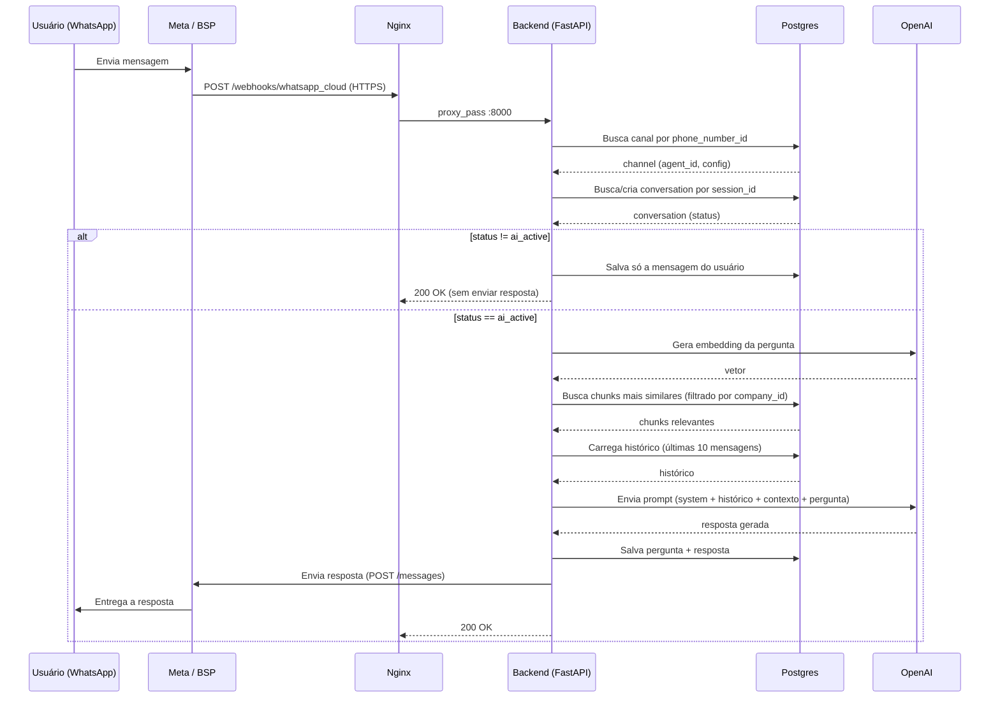

# 17. Fluxo Completo da Mensagem

Este capítulo amarra tudo que os capítulos anteriores explicaram
separadamente, seguindo uma única mensagem do início ao fim.

## 17.1 Diagrama passo a passo

## 17.2 Etapa por etapa, com o código responsável

**1. Mensagem chega no webhook.** `POST /webhooks/whatsapp_cloud`
(`app/api/webhooks/whatsapp_cloud.py`) extrai o `phone_number_id` do payload.

**2. Identificação do canal.**
`ChannelRepository.get_by_identifier(db, "whatsapp_cloud", phone_number_id)`
— é aqui que o sistema descobre a qual empresa/agente aquela mensagem
pertence. Se não achar nenhum canal com esse identificador, `channel` fica
`None`, e o provider é instanciado sem config (cai no fallback do `.env`,
hoje praticamente vazio em produção).

**3. Parse do payload.** `provider.parse_incoming(payload)`
(`WhatsAppCloudProvider.parse_incoming`) transforma o JSON específico da
Meta num objeto `IncomingMessage` padronizado — o resto do sistema nunca
lida com o formato bruto da Meta.

**4. Orquestração.** `ConversationService.handle_message(...)` é chamado
com a pergunta, o `session_id`, `agent_id` e `channel_id`. É o "maestro":

- **4a.** `AgentService.load(db, agent_id)` busca o agente no banco (nome,
  prompt, modelo, temperatura, `company_id`).
- **4b.** `HistoryService.get_or_create_conversation(...)` busca a conversa
  ativa por `session_id` + `agent_id`, ou cria uma nova com
  `status='ai_active'`.
- **4c.** Verificação de status: se `conversation.status != 'ai_active'`, o
  fluxo **para aqui** — salva só a mensagem do usuário
  (`history_svc.save_user_message`) e retorna `None`. O webhook não envia
  nenhuma resposta ao usuário nesse caso.
- **4d.** `KnowledgeService.search(pergunta, company_id=agente.company_id)`
  — busca RAG, filtrada pela empresa (capítulo 7).
- **4e.** `HistoryService.load()` — carrega até 10 mensagens anteriores
  dessa conversa.
- **4f.** `PromptBuilder.build(agente, contexto, historico, pergunta)` —
  monta a lista final de mensagens: `system` (prompt do agente) + histórico
  + a pergunta atual (com o contexto RAG embutido, se houver).
- **4g.** `get_llm_provider(agente.provider_name, model=agente.model)` —
  instancia o provider de IA certo (OpenAI, hoje) via factory.
- **4h.** `provider.generate(messages, temperature=agente.temperature)` —
  chamada real à API da OpenAI, devolve o texto da resposta.
- **4i.** `history_svc.save(pergunta, resposta)` — salva as duas mensagens
  (`role='user'` e `role='assistant'`) no banco, num único commit.

**5. Envio da resposta.** De volta no webhook, se `resposta is not None`:
`provider.send_message(incoming.from_id, resposta)` — chamada HTTP para a
Graph API (Meta ou BSP, dependendo do `api_base_url` do canal).

**6. Resposta HTTP ao provedor.** O webhook sempre devolve `Response("OK",
status_code=200)` para a Meta/BSP, independente do resultado interno —
comportamento explicado no [capítulo 10.3](./10-canais-de-mensagem.md).

## 17.3 O que acontece quando o bot está pausado

Se um humano assumiu a conversa (`conversations.status = 'human_active'`,
ver [capítulo 4.3](./04-banco-de-dados.md)), o fluxo pula diretamente da
etapa 4c para o fim: a mensagem do usuário é salva normalmente (para o
atendente humano poder ver, caso um painel venha a existir no futuro), mas
nenhuma busca RAG, nenhuma chamada à IA e nenhum envio de resposta
acontecem. Isso economiza custo de API (não gasta chamada de IA à toa) e
evita a IA "atropelar" um atendimento humano em andamento.

## 17.4 Tempo típico e onde o tempo é gasto

Os logs (capítulo 12) mostram o tempo de cada etapa individualmente. Em
condições normais, a maior parte do tempo total (`TOTAL` no log) é gasto na
chamada à IA (etapa 4h) — a geração de texto por um LLM é inerentemente mais
lenta que uma consulta a banco. A busca RAG (4d) inclui uma chamada de rede
extra à OpenAI (para gerar o embedding da pergunta) antes mesmo de consultar
o banco — por isso não é instantânea, mesmo sendo "só uma busca".
